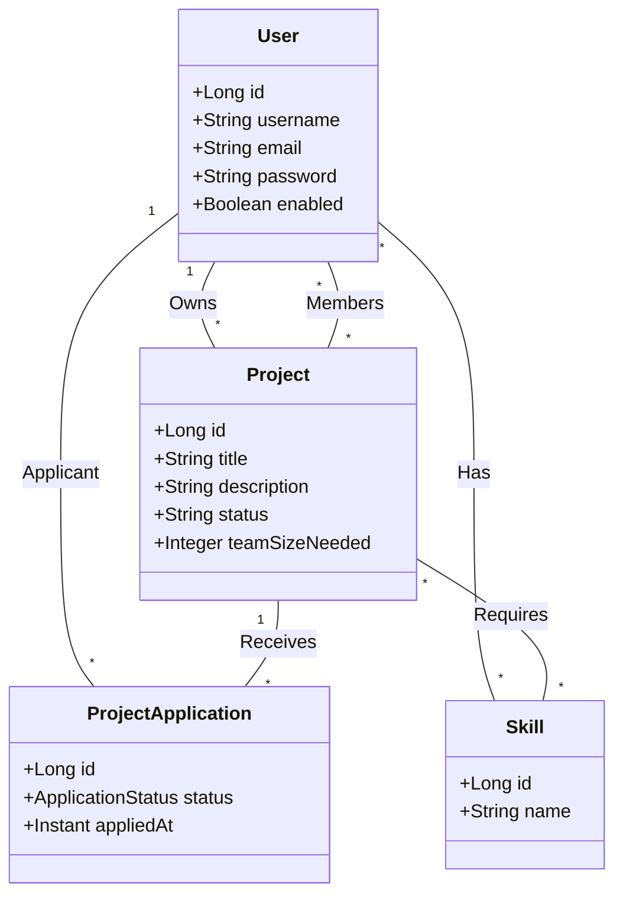
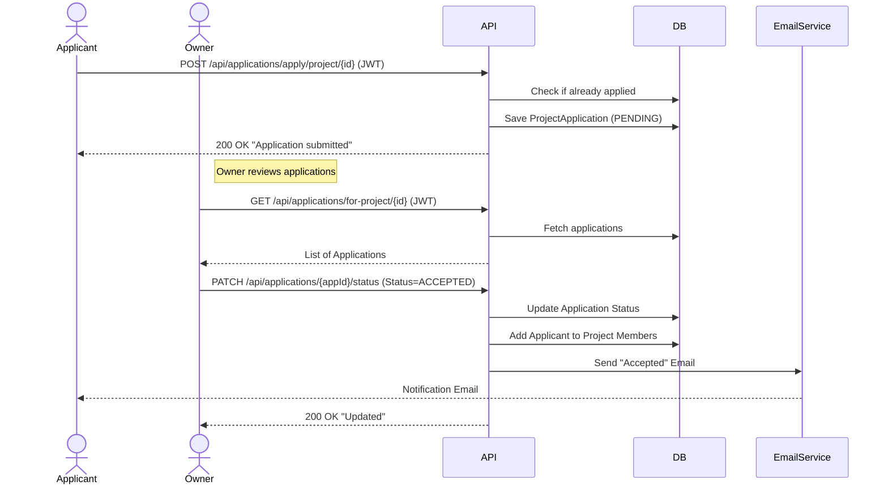

# Application design: CoFound

## 1. Overview

CoFound is a platform designed to connect project creators (founders) with potential collaborators (co-founders or team members). Users can list their projects, specify required skills, and recruit team members. Conversely, users can browse available projects and apply to join teams based on their skills. The system uses a REST API with token-based authentication.

Main user roles: User (General), Project Owner (Poster), Team Member.

## 2. Architecture

**Components:**

*   **Backend API:** Spring Boot (Java 17) application exposing REST endpoints for authentication, project management, and application workflows.
*   **Database:** MySQL for storing users, projects, skills, applications, and verification tokens.
*   **Security:** Spring Security with JWT (JSON Web Tokens) for stateless authentication and role-based access control.
*   **Email:** Integration for sending account verification and notification emails.

## 3. Key Features

*   **Auth:** Register with email verification, Login using JWT tokens.
*   **Profile Management:** Users can manage their profiles and list their technical skills.
*   **Projects:** Create projects with descriptions and required skills. Owners can view team members.
*   **Discovery:** Browse all projects or filter for "available" projects that are actively recruiting.
*   **Applications:** Users can apply to join projects. Project owners can review, accept, or reject applications.
*   **Notifications:** Email notifications for account verification and application status updates.

## 4. Core Entities

| Entity | Attributes | Relationships |
| :--- | :--- | :--- |
| **User** | id, username, email, password, enabled | 1..* Skills 1..* Owned Projects 0..* Joined Projects (Member) 1..* Applications |
| **Project** | id, title, description, status, teamSizeNeeded | belongs to Owner (User) has many Members (User) has many Required Skills has many Applications |
| **ProjectApplication** | id, status (PENDING, ACCEPTED, REJECTED), appliedAt | links Applicant (User) & Project |
| **Skill** | id, name | many-to-many with User & Project |
| **VerificationToken** | id, token, expiryDate | 1-1 with User |

## 5. HTTP API Description

| Endpoint | HTTP Method | Description |
| :--- | :--- | :--- |
| `/auth/register` | POST | Register a new user account (triggers verification email) |
| `/auth/login` | POST | Authenticate and obtain JWT token |
| `/auth/verify` | GET | Verify account using token from email |
| `/api/users/me` | GET / DELETE | Get current user details or delete account |
| `/api/users/me/skills` | GET / POST / DELETE | Manage user skills |
| `/api/projects` | GET / POST | List all projects or Create a new project |
| `/api/projects/available` | GET | List projects that are actively recruiting |
| `/api/projects/{id}/team` | GET | View team members for a project (Owner only) |
| `/api/applications/apply/project/{id}` | POST | Apply to join a specific project |
| `/api/applications/for-project/{id}` | GET | List all applications for a project (Owner only) |
| `/api/applications/{id}/status` | PATCH | Accept or Reject an application (Owner only) |
| `/api/applications/my-applications` | GET | List all applications submitted by the current user |

## 6. UML Class Diagram

## 7. Example Flow Diagram (Project Application)

