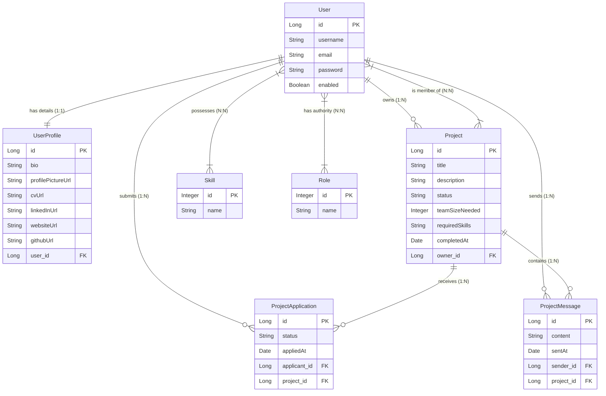

# CoFound Database Schema

This diagram represents the relationships between the entities in the CoFound application.

```mermaid
erDiagram
    %% ENTITIES
    User {
        Long id PK
        String username
        String email
        String password
        Boolean enabled
    }

    UserProfile {
        Long id PK
        String bio
        String profilePictureUrl
        String cvUrl
        String linkedInUrl
        String websiteUrl
        String githubUrl
        Long user_id FK
    }

    Project {
        Long id PK
        String title
        String description
        String status
        Integer teamSizeNeeded
        String requiredSkills
        Date completedAt
        Long owner_id FK
    }

    ProjectApplication {
        Long id PK
        String status
        Date appliedAt
        Long applicant_id FK
        Long project_id FK
    }

    ProjectMessage {
        Long id PK
        String content
        Date sentAt
        Long sender_id FK
        Long project_id FK
    }

    Skill {
        Integer id PK
        String name
    }

    Role {
        Integer id PK
        String name
    }

    %% RELATIONSHIPS

    User ||--|| UserProfile : "has details (1:1)"
    
    User ||--o{ Project : "owns (1:N)"
    
    User }|--|{ Project : "is member of (N:N)"
    
    User ||--o{ ProjectApplication : "submits (1:N)"
    Project ||--o{ ProjectApplication : "receives (1:N)"
    
    User ||--o{ ProjectMessage : "sends (1:N)"
    Project ||--o{ ProjectMessage : "contains (1:N)"
    
    User }|--|{ Skill : "possesses (N:N)"
    
    User }|--|{ Role : "has authority (N:N)"
```
